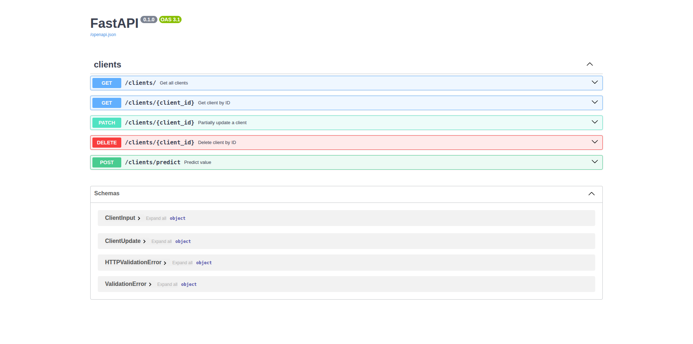
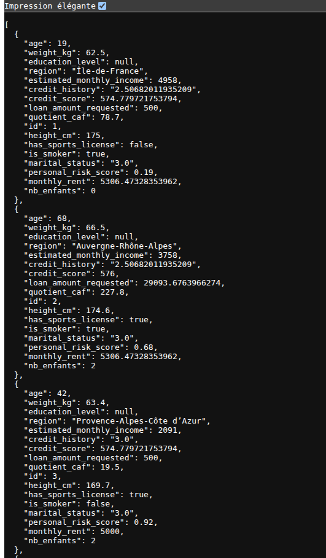
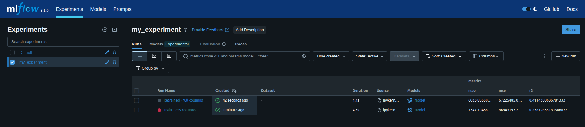
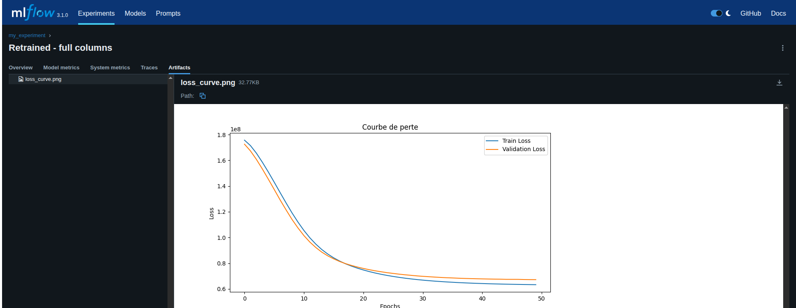

# Description
The aim of this project is create a model from witch with data added into a database by using SQLAlchemy.


## Virtual environment

Linux :
```bash
python3 -m venv .venv
```

MacOS-Windows
```bash
python -m venv .venv
```

## Activate Virtual environment :
Windows : 
```bash
.venv\Scripts\activate
```

macOS/Linux : 
```bash
source .venv/bin/activate
```

## Dependencies :

* Make sure you're in the project directory
* Install dependencies : `pip install -r requirements.txt`
* Alternatively, you can install the libraries yourself by reading requierements.txt file
  
### Project structure
```bash
.
├── alembic
│   ├── env.py
│   ├── README
│   ├── script.py.mako
│   └── versions
│       ├── 67fe14e57389_initial_client_profiles_table.py
│       ├── 6ac219aa4276_ajout_colonnes_orientation_sexuelle_nb_.py
├── alembic.ini
├── assets
│   ├── get-clients.png
│   ├── mflow-result-loss.png
│   └── mlflow-result.png
├── data
│   ├── clean-data.csv
│   ├── data.csv
│   ├── fresh-data.csv
│   └── generated-client.db
├── main.py
├── model_artifacts
│   ├── model1.keras
│   ├── model2.keras
│   ├── model2.pkl
│   └── preprocessor2.pkl
├── models
│   ├── client.py
│   ├── __init__.py
├── module
│   ├── generate_model.py
│   ├── __init__.py
├── notebook
│   ├── analyse_fresh_dataset.ipynb
│   ├── analyse_orignal_dataset.ipynb
│   ├── clean_dataset.ipynb
│   ├── first_model_train.ipynb
│   ├── populate_database.ipynb
│   ├── sql_alchemy.ipynb
│   ├── test_api.ipynb
│   └── train_from_existing_model.ipynb
├── README.md
├── requirements.txt
├── routes
│   ├── client.py
├── run.py
├── schemas
│   ├── client.py
│   ├── __init__.py
├── test_api.py
└── utils
    ├── base.py
    ├── csv_cleaner.py
    ├── csv_mapper.py
    ├── database_management.py
    ├── __init__.py
    ├── outliers.py
    └── trainer_helper.py

```

### Launch project
```bash
python3 run.py
```

### Display API routes (Swagger)
```bash
[docs](http://127.0.0.1:8000/docs)
```

### Execute API test
```bash
pytest test_api.py
```

### Add database migration
```bash
alembic revision --autogenerate -m "mon nom de migration"
```

Apply migration
```bash
alembic upgrade head
```

--- 

# Script explanation 

### Use app and predict value :
```bash 
python3 run.py
``` 
```bash 
curl -X POST "http://localhost:9500/clients/predict" \
-H "Content-Type: application/json" \
-d '{
  "age": 68,
  "height_cm": 174.6,
  "weight_kg": 66.5,
  "has_sports_license": true,
  "education_level": 8,
  "region": "Auvergne-Rhône-Alpes",
  "is_smoker": true,
  "marital_status": "3.0",
  "nb_enfants": 2,
  "quotient_caf": 227.8,
  "estimated_monthly_income": 3758,
  "credit_score": 3.0,
  "personal_risk_score": 2.5068201193520885,
  "credit_history": "0.68",
  "monthly_rent": 576.0,
  "loan_amount_requested": 5306.473283539622
}'
``` 

### Notebook 

**analyse_origianal_dataset.ipynb** :
Analyse default data without columns "nb_enfants" & "quotient_caf"

**analyse_fresh_dataset.ipynb** :
Analyse data with new columns "nb_enfants" & "quotient_caf"

**clean_dataset.ipynb** :
Clear non RGPD columns and anonymise data

**populate_database.ipynb** :
Populate the SQLlite database with clean value

**first_mode_train.ipynb** :
Train model without columns "nb_enfants" & "quotient_caf"

**train_from_existing_model.ipynb** :
Train an existing model with new value "nb_enfants" & "quotient_caf"

### API

**Swagger** : [http://localhost:9500/docs](http://localhost:9500/docs)




### Mlflow
```bash
mlflow ui
```


